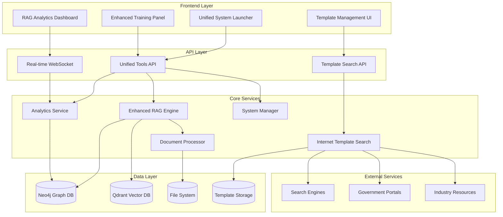

# Design Document

## Overview

Расширенная система управления RAG-обучением представляет собой комплексное решение, состоящее из нескольких взаимосвязанных компонентов:

1. **Enhanced RAG Training Engine** - ядро системы обучения с максимальными настройками
2. **Real-time Analytics Dashboard** - система мониторинга и аналитики в реальном времени  
3. **Internet Template Search System** - интеллектуальный поиск и адаптация шаблонов
4. **Unified System Launcher** - централизованное GUI для управления всей системой
5. **Advanced Document Processing Pipeline** - улучшенный пайплайн обработки документов
6. **Template Management System** - система управления библиотекой шаблонов

## Architecture

### High-Level Architecture



### Component Architecture

#### 1. Enhanced RAG Training Engine

**Responsibilities:**
- Управление процессом обучения RAG-модели
- Конфигурация параметров обучения
- Мониторинг прогресса и метрик
- Управление чекпоинтами и восстановлением

**Key Classes:**
```python
class EnhancedRAGTrainer:
    - training_config: TrainingConfiguration
    - progress_monitor: ProgressMonitor
    - checkpoint_manager: CheckpointManager
    - quality_controller: QualityController
    
class TrainingConfiguration:
    - data_sources: DataSourceConfig
    - processing: ProcessingConfig
    - model: ModelConfig
    - quality: QualityConfig
    - advanced: AdvancedConfig
    
class ProgressMonitor:
    - real_time_metrics: RealTimeMetrics
    - performance_tracker: PerformanceTracker
    - error_analyzer: ErrorAnalyzer
```

#### 2. Real-time Analytics System

**Responsibilities:**
- Сбор метрик в реальном времени
- Анализ качества данных
- Мониторинг производительности системы
- Генерация отчетов и рекомендаций

**Key Classes:**
```python
class AnalyticsEngine:
    - metrics_collector: MetricsCollector
    - quality_analyzer: QualityAnalyzer
    - performance_monitor: PerformanceMonitor
    - report_generator: ReportGenerator
    
class MetricsCollector:
    - system_metrics: SystemMetrics
    - training_metrics: TrainingMetrics
    - document_metrics: DocumentMetrics
    
class QualityAnalyzer:
    - embedding_quality: EmbeddingQualityAnalyzer
    - text_quality: TextQualityAnalyzer
    - coherence_analyzer: CoherenceAnalyzer
```

#### 3. Internet Template Search System

**Responsibilities:**
- Поиск шаблонов в интернете
- Анализ и ранжирование результатов
- Скачивание и адаптация шаблонов
- Управление библиотекой шаблонов

**Key Classes:**
```python
class InternetTemplateSearcher:
    - search_engines: List[SearchEngine]
    - content_analyzer: ContentAnalyzer
    - template_adapter: TemplateAdapter
    - cache_manager: CacheManager
    
class SearchEngine:
    - google_search: GoogleSearchEngine
    - yandex_search: YandexSearchEngine
    - specialized_sources: SpecializedSources
    
class TemplateAdapter:
    - placeholder_replacer: PlaceholderReplacer
    - format_converter: FormatConverter
    - metadata_extractor: MetadataExtractor
```

#### 4. Unified System Launcher

**Responsibilities:**
- Запуск и остановка всех компонентов системы
- Мониторинг состояния компонентов
- Управление зависимостями между сервисами
- Диагностика и восстановление

**Key Classes:**
```python
class SystemLauncher:
    - component_manager: ComponentManager
    - health_monitor: HealthMonitor
    - dependency_resolver: DependencyResolver
    - diagnostic_tool: DiagnosticTool
    
class ComponentManager:
    - neo4j_manager: Neo4jManager
    - backend_manager: BackendManager
    - frontend_manager: FrontendManager
    - rag_manager: RAGManager
```

## Components and Interfaces

### 1. Enhanced RAG Training Interface

```typescript
interface EnhancedRAGTrainingConfig {
  dataSources: {
    customDirectories: string[];
    includeBuiltinSources: boolean;
    documentTypes: string[];
    languageFilter: string[];
    dateRange: [string, string] | null;
    sizeFilter: { min: number; max: number };
    qualityThreshold: number;
  };
  
  processing: {
    chunkSize: number;
    chunkOverlap: number;
    batchSize: number;
    maxWorkers: number;
    enableParallelProcessing: boolean;
    memoryOptimization: boolean;
    smartChunking: boolean;
  };
  
  model: {
    embeddingModel: string;
    modelPrecision: 'fp16' | 'fp32' | 'int8';
    maxSequenceLength: number;
    enableGPU: boolean;
    gpuMemoryFraction: number;
    multiGPU: boolean;
  };
  
  quality: {
    enableDeduplication: boolean;
    similarityThreshold: number;
    enableQualityFiltering: boolean;
    minTextLength: number;
    maxTextLength: number;
    enableLanguageDetection: boolean;
    semanticCoherenceCheck: boolean;
  };
  
  advanced: {
    enableIncrementalTraining: boolean;
    enableCheckpointing: boolean;
    checkpointInterval: number;
    enableLogging: boolean;
    logLevel: 'DEBUG' | 'INFO' | 'WARNING' | 'ERROR';
    enableProfiling: boolean;
    experimentalFeatures: boolean;
  };
}

interface RealTimeTrainingMetrics {
  systemMetrics: {
    cpuUsage: number;
    memoryUsage: number;
    gpuUsage: number[];
    diskIO: number;
    networkIO: number;
  };
  
  trainingMetrics: {
    documentsProcessed: number;
    chunksGenerated: number;
    embeddingsCreated: number;
    processingSpeed: number;
    throughput: number;
    errorRate: number;
  };
  
  qualityMetrics: {
    averageEmbeddingQuality: number;
    textCoherence: number;
    languageDetectionAccuracy: number;
    duplicateDetectionRate: number;
  };
}
```

### 2. Template Search Interface

```typescript
interface TemplateSearchRequest {
  query: string;
  documentType: 'contract' | 'report' | 'application' | 'letter' | 'act' | 'estimate';
  companyType: 'construction' | 'government' | 'business' | 'manufacturing';
  projectType?: string;
  workType?: string;
  language: 'ru' | 'en' | 'mixed';
  searchSources: string[];
}

interface TemplateSearchResult {
  id: string;
  title: string;
  url: string;
  source: string;
  relevanceScore: number;
  documentType: string;
  fileSize: number;
  format: string;
  preview?: string;
  metadata: {
    author?: string;
    organization?: string;
    lastModified?: string;
    tags: string[];
  };
}

interface TemplateAdaptationRequest {
  templatePath: string;
  companyInfo: {
    name: string;
    address: string;
    phone: string;
    email: string;
    inn: string;
    kpp: string;
    director: string;
    [key: string]: any;
  };
  projectInfo?: {
    name: string;
    type: string;
    location: string;
    budget: number;
    timeline: string;
    [key: string]: any;
  };
}
```

### 3. System Launcher Interface

```typescript
interface SystemComponent {
  id: string;
  name: string;
  type: 'service' | 'database' | 'application';
  status: 'stopped' | 'starting' | 'running' | 'error' | 'stopping';
  port?: number;
  dependencies: string[];
  healthCheck: () => Promise<boolean>;
  start: () => Promise<void>;
  stop: () => Promise<void>;
  restart: () => Promise<void>;
}

interface SystemStatus {
  overall: 'healthy' | 'degraded' | 'critical' | 'offline';
  components: Map<string, ComponentStatus>;
  uptime: number;
  lastCheck: Date;
}

interface ComponentStatus {
  status: SystemComponent['status'];
  health: 'healthy' | 'warning' | 'critical';
  metrics: {
    cpuUsage?: number;
    memoryUsage?: number;
    responseTime?: number;
    errorRate?: number;
  };
  lastError?: string;
}
```

## Data Models

### 1. Training Session Model

```python
@dataclass
class TrainingSession:
    id: str
    name: str
    config: EnhancedRAGTrainingConfig
    status: TrainingStatus
    start_time: datetime
    end_time: Optional[datetime]
    progress: TrainingProgress
    metrics: TrainingMetrics
    checkpoints: List[Checkpoint]
    errors: List[TrainingError]
    
@dataclass
class TrainingProgress:
    stage: str
    substage: Optional[str]
    progress_percent: float
    current_step: int
    total_steps: int
    time_elapsed: int
    time_remaining: int
    throughput: float
    
@dataclass
class DocumentProcessingInfo:
    id: str
    filename: str
    path: str
    size: int
    type: str
    language: str
    quality_score: float
    chunks_count: int
    embeddings_count: int
    processing_time: float
    status: ProcessingStatus
    errors: List[str]
    metadata: Dict[str, Any]
```

### 2. Template Model

```python
@dataclass
class Template:
    id: str
    name: str
    category: str
    document_type: str
    file_path: str
    original_url: Optional[str]
    version: str
    created_at: datetime
    updated_at: datetime
    usage_count: int
    tags: List[str]
    placeholders: List[Placeholder]
    metadata: TemplateMetadata
    
@dataclass
class Placeholder:
    name: str
    type: str  # text, number, date, etc.
    required: bool
    default_value: Optional[str]
    description: str
    
@dataclass
class TemplateMetadata:
    author: Optional[str]
    organization: Optional[str]
    file_size: int
    format: str
    complexity: str  # simple, medium, complex
    estimated_fields: int
```

### 3. Analytics Model

```python
@dataclass
class AnalyticsSnapshot:
    timestamp: datetime
    session_id: str
    system_metrics: SystemMetrics
    training_metrics: TrainingMetrics
    quality_metrics: QualityMetrics
    
@dataclass
class SystemMetrics:
    cpu_usage: float
    memory_usage: float
    gpu_usage: List[float]
    disk_io: float
    network_io: float
    temperature: Optional[float]
    
@dataclass
class QualityMetrics:
    overall_score: float
    embedding_quality: float
    text_coherence: float
    language_detection_accuracy: float
    duplicate_detection_rate: float
    semantic_similarity: float
```

## Error Handling

### 1. Training Errors

```python
class TrainingError(Exception):
    def __init__(self, message: str, error_type: str, 
                 stage: str, document_id: Optional[str] = None):
        self.message = message
        self.error_type = error_type  # processing, memory, gpu, network, format
        self.stage = stage  # loading, extraction, chunking, embedding, storage
        self.document_id = document_id
        self.timestamp = datetime.now()
        
class ErrorRecoveryStrategy:
    def handle_memory_error(self, error: TrainingError) -> RecoveryAction
    def handle_gpu_error(self, error: TrainingError) -> RecoveryAction
    def handle_processing_error(self, error: TrainingError) -> RecoveryAction
    def handle_network_error(self, error: TrainingError) -> RecoveryAction
```

### 2. System Component Errors

```python
class ComponentError(Exception):
    def __init__(self, component_id: str, error_message: str, 
                 error_code: str, recovery_suggestion: str):
        self.component_id = component_id
        self.error_message = error_message
        self.error_code = error_code
        self.recovery_suggestion = recovery_suggestion
        self.timestamp = datetime.now()
        
class SystemRecovery:
    def diagnose_component(self, component_id: str) -> DiagnosticResult
    def attempt_recovery(self, component_id: str) -> RecoveryResult
    def escalate_issue(self, component_id: str, error: ComponentError) -> None
```

## Testing Strategy

### 1. Unit Testing

**RAG Training Engine Tests:**
- Configuration validation tests
- Document processing pipeline tests
- Embedding generation tests
- Quality control tests
- Checkpoint management tests

**Template Search Tests:**
- Search engine integration tests
- Content analysis tests
- Template adaptation tests
- Cache management tests

**System Launcher Tests:**
- Component lifecycle tests
- Dependency resolution tests
- Health monitoring tests
- Error recovery tests

### 2. Integration Testing

**End-to-End Training Flow:**
- Complete training session from start to finish
- Real-time analytics data flow
- Error handling and recovery
- Performance under load

**Template Management Flow:**
- Search → Download → Adapt → Use workflow
- Template versioning and updates
- Multi-user template sharing

**System Management Flow:**
- Full system startup and shutdown
- Component failure and recovery
- Cross-component communication

### 3. Performance Testing

**Load Testing:**
- High-volume document processing
- Concurrent training sessions
- Multiple template searches
- System resource limits

**Stress Testing:**
- Memory exhaustion scenarios
- GPU overload conditions
- Network connectivity issues
- Disk space limitations

### 4. User Acceptance Testing

**Training Management:**
- Configuration ease of use
- Real-time monitoring clarity
- Error message comprehensibility
- Performance optimization guidance

**Template Management:**
- Search result relevance
- Adaptation accuracy
- Template organization
- Usage workflow efficiency

**System Management:**
- Startup/shutdown reliability
- Status information clarity
- Error diagnosis helpfulness
- Recovery process effectiveness

## Security Considerations

### 1. Internet Template Search Security

- **URL Validation:** Проверка безопасности URL перед скачиванием
- **Content Scanning:** Антивирусная проверка скачанных файлов
- **Sandboxing:** Изолированная обработка внешних документов
- **Access Control:** Ограничение доступа к внешним ресурсам

### 2. Data Protection

- **Encryption:** Шифрование чувствительных данных в покое и при передаче
- **Access Logging:** Детальное логирование доступа к данным
- **Data Anonymization:** Анонимизация персональных данных в логах
- **Backup Security:** Защищенное резервное копирование

### 3. System Security

- **Authentication:** Многофакторная аутентификация для административных функций
- **Authorization:** Ролевая модель доступа к функциям системы
- **Network Security:** Защищенные соединения между компонентами
- **Audit Trail:** Полный аудит всех системных операций

## Performance Optimization

### 1. RAG Training Optimization

- **Batch Processing:** Оптимальные размеры батчей для GPU
- **Memory Management:** Эффективное использование памяти
- **Parallel Processing:** Многопоточная обработка документов
- **Caching:** Кэширование промежуточных результатов

### 2. Real-time Analytics Optimization

- **Data Streaming:** Эффективная передача метрик в реальном времени
- **Aggregation:** Предварительная агрегация данных
- **Compression:** Сжатие данных для передачи
- **Sampling:** Интеллектуальная выборка для снижения нагрузки

### 3. Template Search Optimization

- **Search Caching:** Кэширование результатов поиска
- **Parallel Requests:** Параллельные запросы к разным источникам
- **Result Ranking:** Эффективные алгоритмы ранжирования
- **Content Deduplication:** Быстрое обнаружение дубликатов

### 4. System Launcher Optimization

- **Startup Optimization:** Параллельный запуск независимых компонентов
- **Health Check Efficiency:** Оптимизированные проверки состояния
- **Resource Monitoring:** Эффективный мониторинг ресурсов
- **Graceful Shutdown:** Корректное завершение всех процессов